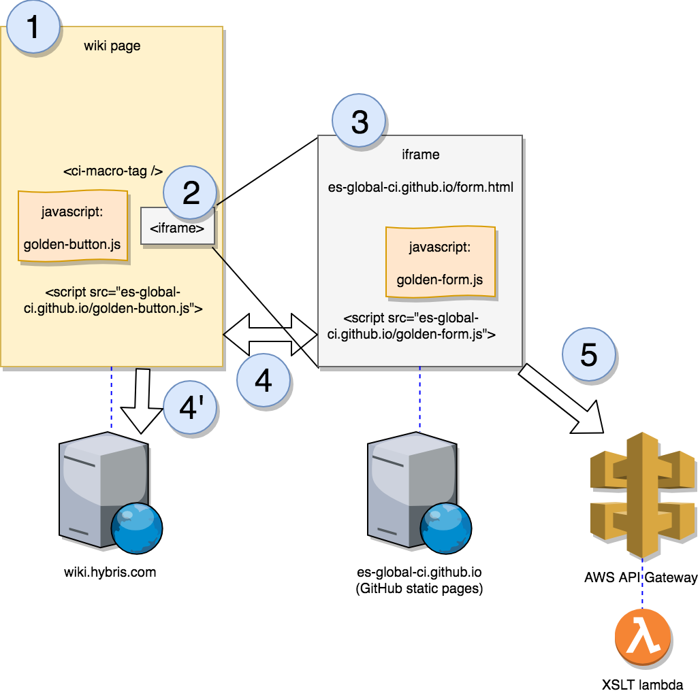

# The Golden Button yWikiPlugin

## Architecture overview

This pure front-end plugin for Confluence wiki is hosted on GitHub static pages (could be hosted in AWS S3 instead), and is used by adding a script tag to a wiki page (1), using the `{html}` macro. Typically this script will look for some specific markup on the page, for example `<ci-macro-tag>` in this diagram, and inject code there, in general an `<iframe>` whose source is also hosted on GitHub static pages (2). Inside the iframe (3), we can use any framework we want for our application, however, due to the Same Origin Policy, the iframe cannot directly access the wiki API. So we are using inter-frame message to communication between the wiki page and the iframe (4), and the main script running on the wiki page will do the actual Confluence REST API calls (4'). An additional REST webservice is called from the iframe to perform wiki page XSL transformation in a reliable way (5), this webservice is implemented by a lambda using Serverless framework (code in [serverless](serverless)).



## Development environment

```bash
# First time only (or when dependencies change)
npm install

# Start the local server
docker-compose up -d

# Set up an automatic build of js files with:
npm run watch
```

## Note

* This project uses [webpack](https://webpack.js.org/guides/get-started/) to compile, concatenate and minify the javascripts and css. 
* The `docs/dist` folder is versioned because the generated bundled scripts and styles are exposed as a [GitHub page](https://help.github.com/articles/configuring-a-publishing-source-for-github-pages/) to be included in Confluence wiki pages via `HTML` macros. 
* Keep `npm run watch` running, or at least run it once before committing changes to the source css or js files, and commit all changes to files in the `docs/dist` folder.
* Because XSLT (used to transform the wiki page content) is very Browser sensitive and not supported equally by IE Chrome or Firefox, a server-side implementation is used. It is provided by an AWS lamdba, deployed through the serverless framework. See [serverless](serverless).

## Usage

See [Continuous Improvement - The Golden Button](https://wiki.hybris.com/display/ps/Continuous+Improvement+-+The+Golden+Button)


## Tests

To run the set of unit tests, create a wiki page with following content in an `{html}` macro.

```
 <div id="mocha"></div>

  <script src="https://unpkg.com/chai/chai.js"></script>
  <script src="https://unpkg.com/mocha@5.2.0/mocha.js"></script>

  <script src="https://localhost/ywiki-plugins/dist/tests-bundle.js"></script>
```

Set some edit restriction on the page to let Confluence execute the `{html}` macro.

The `tests-bundle.js` created by webpack contains all `*.test.js` files written with `mocha` and `chai`.
They can use Confluence API since the tests directly execute within the context of the wiki page.
Note that for now, some page identifiers and titles are harcoded in tests and are necessary for the tests to pass.


## TODO

Check permissions on the source - we have to edit the source TS. The error message canbe wrong

## Sync Tool

Add the following to an `{html}` macro on empty page with edit restrictions:

```
<ci-sync-app data-source-space="espw" data-target-space="servportfolio" data-source-root-page="Services Portfolio - Services" data-target-parent-page="Services Portfolio" />
<script src="https://localhost/ywiki-plugins/dist/space-sync-bundle.js"></script>
```


Provided you have admin permission on the target space, the syncTool will attempt to get edit permission on the pages that need to be published.